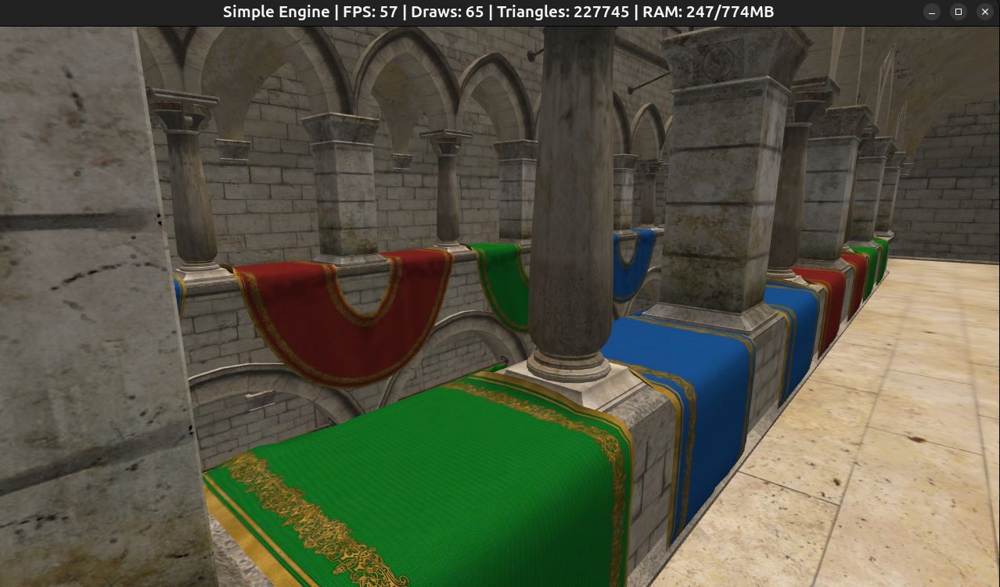
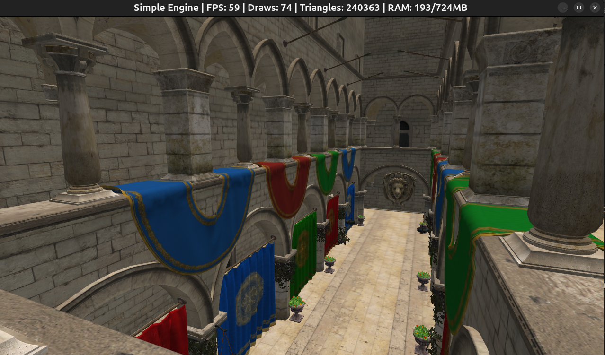

# A simple engine

Modern C++23 OpenGL4.6 engine that can be used as a starting point for more complex engines or games. It focuses on clarity and a small feature set while keeping modern practices.

## Demo Sponza scene
Both GLTF and GLB versions of the Sponza model are included in the `assets/` folder.

| Format | Load Time | Size | Textures |
|--------|-----------|------|----------|
| GLTF | ~5s | 247MB | External files |
| GLB | ~3s | 194MB | Embedded |


*Sponza GLTF model with external textures*


*Sponza GLB model with embedded textures*

## Build & Run

This project uses **[vcpkg](https://github.com/microsoft/vcpkg)** for dependency management and **[CMake](https://cmake.org/) + [Make](https://www.gnu.org/software/make/)** for building.

> Supported platforms: Windows, Linux
> Requires: CMake ≥ 3.20, Make, C++23 compiler

> A CMakePresets.json file and launch configurations are included for easy configuration with VS Code's CMake Tools extension.

---

### 1. Install Dependencies
First install the required libraries using vcpkg:

On Windows:
```bash
vcpkg install --triplet x64-windows
```
or on Linux:
```bash
vcpkg install --triplet x64-linux
```
### 2. Configure
Configure the project with the correct toolchain:
```bash
make configure
```
> This automatically detects your OS and selects the appropriate vcpkg path.
### 3. Build
Build the project:
```bash
make build
```
### 4. Run
Run the demo:
```bash
make run
```
### 5. Clean Build Files
Optionally, you can clean the build files with:
```bash
make clean
```

## Features
- OpenGL 4.6 DSA for buffers/VAOs/textures.
- Frame UBO for per-frame camera and light data.
- Directional sun + ambient + optional point lights.
- Instanced rendering, CPU batching by mesh/material with frustum culling.
- glTF/glb model loading with tinygltf.
- Simple camera controller with mouse look and WASD movement.
- Wireframe toggle and fullscreen mode.
- Basic stats display with configurable update interval.
- Simple event system for input handling.
- Asset manager with caching for shaders, textures, materials and models.
- Simple config system with INI sections.

## Project dependencies
- OpenGL + GLAD for rendering.
- GLFW for windowing and input.
- GLM for math.
- stb_image for textures.
- tinygltf for glTF models.
- SimpleIni for config parsing.

## Project layout
- assets: Shaders, textures, models, and materials.
- build: CMake build output.
- src: Engine code.
- CMakeLists.txt, Makefile, vcpkg.json, vcpkg-configuration.json, CMakePresets.json, and launch configurations.

## Engine architecture

### Core
- Application: Owns the main loop, window, renderer, asset manager, and scene.
- Window: GLFW setup, OpenGL context, and event callbacks.
- Input: Frame-based input state built from events.
- EventBus: Small event queue used by window callbacks.
- Config: Reads config.ini for runtime settings.
- StatsTracker: Tracks and averages frame time, draw calls, etc.

### Assets
- Asset: Minimal base class with a path.
- AssetHandle: Lightweight, type-safe references to assets.
- AssetManager: Loads and caches shaders, textures, models, and materials.
- Shader: GLSL program compilation and uniform updates.
- Texture: Image loading and OpenGL texture setup.
- Material: Shader + textures + render state, matching glTF data. Lighting is simple diffuse.
- Model: Loads glTF/glb into meshes and materials.

### Render
- Mesh: Vertex and index buffers with instanced rendering.
- Renderer: Batches by mesh + material and draws instanced geometry (Frame UBO + lights).
- Renderable: Mesh + material + transform tuple submitted to the renderer.
- Buffer: OpenGL buffer wrapper for vertex/index data.
- VertexArray: OpenGL VAO wrapper for vertex attribute setup.
- UniformBuffer: OpenGL UBO wrapper for per-frame data.
- Frustum: View frustum for culling.

### Scene
- Scene: Owns renderables and updates game logic.
- Player: Camera controller (mouse look + WASD).
- Camera: View and projection math.
- Transform: Position, rotation, scale helper.
- Light: Defines directional and point lights.
- Sun: Directional light with color and intensity.
- Sky: Simple sky color and ambient light.

## Controls
- WASD: Move
- Mouse: Look
- Space / Left Ctrl: Up / down
- F3: Wireframe toggle
- F12: Toggle fullscreen
- Esc: Quit

## Config
Settings are loaded from config.ini with sections for window, input, camera, and stats.

## Potential improvements
- Better error handling and logging. Using a logging library like spdlog would be a good improvement.
- More robust asset management with reference counting and unloading/reloading.
- More complete glTF/glb support (animations, PBR materials, Draco compression, etc). This would require updating the material system to support PBR shaders and adding animation support in the renderer and scene. And also update Mesh as right now it only supports static meshes without animations.
- More flexible renderer with support for multiple passes, post-processing, etc.
- Adding more complex lighting models, shadows, and post-processing effects.
- More complete input handling with action mapping and support for gamepads.
- More complete scene management with entities, components, and systems.
- Debug rendering and tools for inspecting the scene and assets. Using a library like ImGui would be great for this.
- UI system for in-game menus, HUD, etc. Using RmlUI or similar would be a good option.
- Multithreading for asset loading(it requires mutexes for their maps) and potentially rendering (if using Vulkan as OpenGL is not thread-friendly).
- Using Vulkan instead of OpenGL for better performance and modern features.
- Serialization for saving/loading scenes and assets.
- Editor mode with real-time scene editing and asset management.
- Memory and Performance profiling to identify bottlenecks and optimize critical paths. Using a profiler like Tracy would be very helpful for this.
- Cube map support for skyboxes and reflections.
- Support different uniform variables for different shaders. Right now the uniform variables is set up in the renderer flushBatch method. For example for water it would need different uniform variables for the water shader. It could be done by either:
    1. Add a parameter to flushBatch to specify which shader to use, and set the appropriate uniforms based on that.
    2. Create a separate flushBatch method for water that sets the water-specific uniforms.
- Event system improvements:
    1. Add a handled flag or priority to stop propagation (useful for UI capturing input).
    2. Add event categories to subscribe to groups (e.g., an input layer only listens to keyboard/mouse, editor tools only listen to window events).
    3. Keep deferred (queued) events but optionally add immediate dispatch for input-only events (keyboard, mouse).
- Multi-window support.