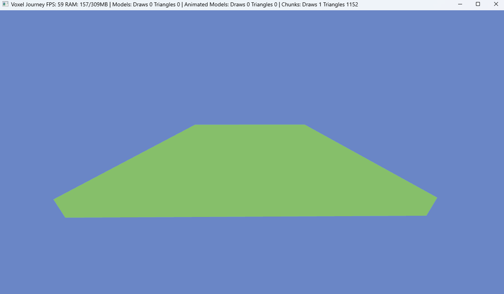

# Voxel Journey
This project is a fork of [simpleengine](https://github.com/kafkaphoenix/simpleengine), focused on building a voxel engine. It’s fully open-source and documented as it evolves.
Along the way, I’ll be sharing blog posts that cover design decisions, implementation details, and the challenges I run into. You can find them in the blog section [voxel-journey](https://kafkaphoenix.github.io/categories/voxel-journey/).

## Engine Features
- OpenGL forward renderer with static instancing (mesh/material batching), frustum culling and post-processing.
- Diffuse lighting with multiple light sources.
- Third-person and first-person camera controllers.
- Fixed-step gameplay update loop for consistent movement, animation, and root motion.
- Skeletal animation with clip blending and optional grounded root motion.
- Basic stats display.
- Simple event system for input handling and window events.
- Asset manager with caching using lightweight handles.
- Configuration system using TOML files.

For a more detailed look at the engine’s architecture, check out the [game-engine](https://kafkaphoenix.github.io/categories/game-engine/) blog section and the [architecture](docs/architecture.md).

## Build & Run

- Configure: `make configure`
- Build: `make build`
- Run: `make run`
- RenderDoc: `make renderdoc`
- Static analysis: `make tidy`
- Format: `make format`

See the [build instructions](docs/build.md) for detailed steps on how to build and run the engine.

## Controls
- WASD: Move
- Left Shift: Run
- Mouse: Look
- V: Toggle camera mode (first/third person)
- F3: Wireframe toggle
- F4: Cycle post-process effect (none, tone map, inversion, grayscale, sharpen, blur, edge detect)
- F5: Cycle stats mode (basic/timing averages)
- F6: Cycle material debug view (lit, normals, albedo, NdotL, roughness, metallic, occlusion, normal map,
    linear depth, material ID, OIT revealage, emissive, shadow placeholder)
- F12: Toggle fullscreen
- Esc: Quit

## Runtime Config

Settings live in `config.toml` and are grouped by subsystem:

- `window`: title, size, position, vsync, mode
- `player`: spawn position
- `characterController`: walk/run speeds, mouse sensitivity/smoothing, turn responsiveness, root motion enable flag
- `camera`: projection settings (FOV, near/far)
- `cameraController`: third-person follow and first-person eye parameters
- `render`: MSAA sample count and anisotropy level
- `postProcess`: exposure
- `stats`: enable flag and update interval

<table>
  <tr>
    <td align="center">
       
      <em>Voxel Chunk</em>
    </td>
  </tr>
</table>
